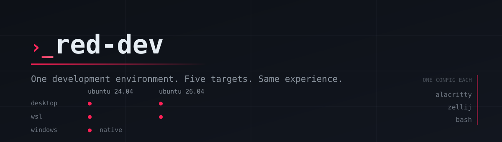
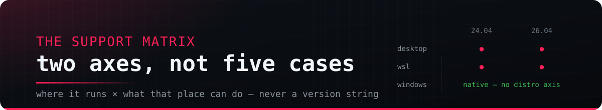
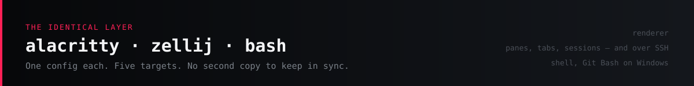
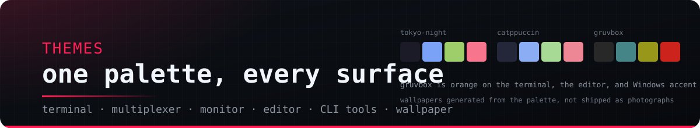

<div align="center">



<p>
  <a href="https://github.com/reddb-io/red-dev/actions/workflows/release.yml"></a>
  <a href="LICENSE"></a>
  <a href="#the-support-matrix"></a>
  <a href="#the-identical-layer"></a>
</p>

<strong>One development environment. Five targets. The same experience on each.</strong><br>
red-dev installs the same tools, shell, terminal, tiling and theme on bare-metal
Ubuntu, on WSL, and on native Windows — from a single binary that needs no
runtime, no bash on Windows, and no second configuration to keep in sync.

<sub>Built on the ideas of <a href="https://omakub.org">Omakub</a> by
<a href="https://dhh.dk">DHH</a> and Basecamp — <a href="#attribution">credit where it is due</a>.</sub>

</div>

---

## Contents

| Getting there | What it is | Living with it |
| --- | --- | --- |
| [Quick start](#quick-start) | [The support matrix](#the-support-matrix) | [Usage](#usage) |
| [Attribution](#attribution) | [The identical layer](#the-identical-layer) | [Using it on each target](#using-it-on-each-target) |
| [Develop](#develop) | [One directory both sides read](#one-directory-both-sides-read) | [Themes](#themes) |
| [Status](#status) | [Under the hood](#under-the-hood) | [Troubleshooting](#troubleshooting) |

---

## Quick start

Linux and WSL:

```bash
curl -fsSL https://raw.githubusercontent.com/reddb-io/red-dev/main/boot.sh | sh
```

Native Windows:

```powershell
irm https://raw.githubusercontent.com/reddb-io/red-dev/main/boot.ps1 | iex
```

Both resolve the binary for your platform from the latest release, install it
under your own user, and then **open red-dev's own interface** — the same screen
you get by typing `red-dev`, where you choose between a first install and
maintenance. The bootstrap and the binary arrive at the same place on purpose;
running the one-liner is how you get the product, not a different, shorter
version of it.

Neither needs administrator or root rights for red-dev itself; individual
packages may still ask for sudo.

On Windows, open a new terminal after installing — the `PATH` entry does not
reach shells that were already running.

Every push to `main` also publishes a `next` prerelease, so the newest work is
installable without waiting for a tag:

```bash
RED_DEV_CHANNEL=next sh -c "$(curl -fsSL https://raw.githubusercontent.com/reddb-io/red-dev/main/boot.sh)"
```

```powershell
$env:RED_DEV_CHANNEL='next'; irm https://raw.githubusercontent.com/reddb-io/red-dev/main/boot.ps1 | iex
```

| Variable | Effect |
| --- | --- |
| `RED_DEV_CHANNEL` | `stable` (default) or `next` — every push to `main` publishes a `next` prerelease |
| `RED_DEV_BIN_DIR` | Where the binary lands; defaults to `~/.local/bin` (Linux) or `%LOCALAPPDATA%\red-dev\bin` |
| `GITHUB_TOKEN` | Raises the API rate limit; required only for a private fork |

---

## Attribution

**This project is inspired by, and derived from, [Omakub](https://omakub.org) by
[David Heinemeier Hansson](https://dhh.dk) and Basecamp.** The omakase
philosophy, the curated tool selection, the aliases, the minimal prompt, the
LazyVim setup and the theme system all started there, and the credit for them is
his.

Omakub targets Ubuntu 24.04 on the desktop. red-dev runs that environment on
Ubuntu 24.04 and 26.04, inside WSL and on native Windows — one binary, one
configuration, no second copy to keep in sync. Where the two disagree it is
about portability, never about taste.

Also built on [tuiuiu.js](https://github.com/forattini-dev/tuiuiu.js) for the
interactive layer and
[cli-args-parser](https://www.npmjs.com/package/cli-args-parser) for the command
surface.

---



## The support matrix

|                         | Ubuntu 24.04 | Ubuntu 26.04 |
| ----------------------- | ------------ | ------------ |
| **Desktop, bare metal** | target 1     | target 2     |
| **WSL**                 | target 4     | target 5     |
| **Windows, native**     | target 3 — no distro axis   ||

Two axes, not five cases. Code branches on **where it runs** and **what that
place can do**, never on a raw version string. Ask a machine what it is:

```bash
red-dev platform
```

```console
os=linux distro=ubuntu version=24.04 env=wsl arch=x64
caps: apt=1 gui=0 systemd=1 winget=1 flatpak=1
```

```console
os=windows distro=n/a version=n/a env=windows arch=x64
caps: apt=0 gui=1 systemd=0 winget=1 flatpak=0
```

Read the first as: a WSL distro with no display of its own, but able to reach
the Windows host through `winget`. That single pair — `gui=0 winget=1` — is why
the WSL target installs fonts and terminal configuration **on Windows** rather
than inside Ubuntu, where they would accomplish nothing.

Adding Ubuntu 28 should mean touching [`src/platform.ts`](src/platform.ts) and
the manifest, nothing else.

---



## The identical layer

The terminal layer is the same on all five targets, because every piece of it
has a real build on every one of them.

| | | |
| --- | --- | --- |
| **Alacritty** | terminal | one `alacritty.toml`, one theme file |
| **zellij** | panes, tabs, sessions, layouts | one `config.kdl`, works over SSH |
| **bash** | shell | one set of dotfiles, Git Bash on Windows |

Alacritty deliberately has no panes, and the platform-native tiling answers
share nothing — GNOME extensions on Linux, FancyZones on Windows. Putting the
panes **inside** the terminal is what makes tiling identical everywhere, and it
keeps working over SSH, which no window manager can offer.

On native Windows the terminal launches **Git Bash, not PowerShell**. That is
what makes the shipped dotfiles apply there at all, and it is why standardising
on bash rather than PowerShell is what makes "same experience" true instead of
aspirational.

---

### zellij is the session, not a command you run

Every interactive shell starts inside zellij. omakub gets this by pointing
Alacritty's shell at `zellij`, which works because there the terminal and the
multiplexer are the same machine's programs. Here they are not: under WSL and
Git Bash the terminal is a Windows program and zellij is not, and Windows
Terminal, the VS Code terminal and every SSH session never read Alacritty's
config at all.

So it starts from [`config/bash/zellij.sh`](config/bash/zellij.sh) instead —
the one layer every target shares. One behaviour in the terminals red-dev
configures and in the ones it does not, and on the far end of an SSH
connection, which no terminal config can reach. It also settles `TERM`: a pane
gets `xterm-256color` everywhere, rather than `alacritty` in one place and
something else in another.

It stays out of the way where a multiplexer would break things — non-interactive
shells, no tty, tmux, the VS Code and JetBrains terminals, nvim's `:terminal`,
`TERM=dumb`. And it does not `exec`: a zellij that cannot start leaves you in a
plain shell with a message, because the alternative is a terminal that closes as
fast as it opens and no way to edit the dotfile that would fix it.

Turn it off with `RED_ZELLIJ=0` in `~/.config/red-dev/env.sh`.

Because zellij is now always on, its own keybindings would be taking `Ctrl-p`,
`Ctrl-t`, `Ctrl-n`, `Ctrl-o` and `Ctrl-s` from the shell that had them first. So
`config.kdl` starts in **locked** mode with the defaults cleared: `Ctrl-g`
unlocks, every binding returns to locked, and `Alt` plus arrows or `hjkl` moves
between panes without leaving it.

The clipboard is one behaviour reached three ways. On a real Linux desktop
zellij's copy command targets `wl-copy`, so `wl-clipboard` is a declared
`desktop` dependency rather than a tool you are assumed to already have. WSL and
native Windows cross to the Windows clipboard instead, and there text stays
Unicode: zellij sends UTF-8, and red-dev's low-latency bridge converts it to
BOM-less UTF-16LE before `clip.exe` reads it. That avoids both `clip.exe`'s
OEM-code-page mojibake and zellij's one-second timeout for clipboard commands. Mouse selection copies automatically. In
Alacritty, paste is `Ctrl+V` or `Ctrl+Shift+V`; `Ctrl+Shift+C` copies an
Alacritty selection, while plain `Ctrl+C` remains the application's interrupt
key. Inside a mouse-capturing TUI such as herdr, normal drag selection belongs
to herdr and is copied automatically; hold `Shift` while dragging to select in
Alacritty instead, or use herdr's copy mode (`Ctrl+B`, then `[`).

### Your half of every file red-dev owns

A converge may replace everything red-dev wrote. It never writes the layer
beside it, which is where your half lives — so an edit you make there survives
every upgrade, and regenerating an owned file stops being something to be
careful about.

| Surface | red-dev writes | you write |
| --- | --- | --- |
| **bash** | `~/.local/share/red-dev/config/bash/*` | `~/.config/red-dev/env.sh` |
| **Alacritty** | `keys.toml`, `font.toml`, `cursor.toml` | `alacritty.toml` |
| **zellij** | `config.kdl` | `config.user.kdl`, beside it |

bash and Alacritty read their layer themselves: it is sourced or imported last,
so it wins. zellij has neither an include mechanism nor a config red-dev leaves
alone, so red-dev composes instead — `config.kdl` is red-dev's base plus your
`config.user.kdl`, and anything the layer declares replaces red-dev's version of
it. Name only what you want to change; a mode you name keeps every binding
red-dev put in it except the keys you rebind.

```kdl
// ~/.config/zellij/config.user.kdl
keybinds {
    shared_except "locked" {
        bind "Ctrl y" { Quit; }
    }
}

scroll_buffer_size 100000
```

`red-dev install core` composes it in and `red-dev doctor` reports a `config.kdl`
older than the layer. On a machine with a shared root the layer sits in the share
beside the config, so both sides of a WSL boundary read the same one. A
`config.kdl` you wrote yourself is still yours: red-dev will not overwrite it,
and says so rather than composing over it. See
[ADR 0007](.red/adr/0007-the-user-layer.md).

### The tools

`git` · `curl` · `ripgrep` · `fd` · `bat` · `eza` · `zoxide` · `fzf` · `btop` ·
`jq` · `fastfetch` · `gh` · `lazygit` · `lazydocker` · `zellij` · `mise` ·
`neovim` · `docker` · `delta` · `yazi` · `tldr` · `starship` · `atuin` ·
`carapace` · `direnv`

**The RedDB tools** come with it, because this is the environment a RedDB
developer works in:

| | | |
| --- | --- | --- |
| [`red`](https://github.com/reddb-io/reddb) | the RedDB CLI | every target |
| [`tq`](https://github.com/reddb-io/toon) | query and convert TOON | every target |
| [`red-request`](https://github.com/reddb-io/red-request) | API client, powered by recker | desktop sessions |
| [`red-ui`](https://github.com/reddb-io/red-ui) | universal client for reddb | desktop sessions — see below |
| [`dit`](https://github.com/reddb-io/dit) | push-to-toggle voice dictation | desktop sessions |
| [`herdr`](https://herdr.dev) | several agents in one terminal, alive over SSH | Linux and WSL |

`red` and `tq` are CLIs, so they are `core` and land on all five targets.
`red-request`, `red-ui` and `dit` are `desktop`, which also means WSL never
attempts them: installing a Linux GUI app inside a distro with no display is the
mistake this project exists to avoid, and the Windows target already covers that
same machine.

`dit` is a CLI and still `desktop`, for the same reason wearing different
clothes — it types into the *focused application*, and under WSL there is
neither one of those nor a `/dev/input` to read its hotkey from. On Linux it
comes from the publisher's installer rather than the release binary, and not for
the usual checksum reason: dit reads its hotkey from `/dev/input` and types
through `/dev/uinput`, so it needs you in the `input` group and a udev rule.
Dropping the binary in gives you a program that runs and cannot see a keypress.
red-dev passes `--yes` to keep the converge non-interactive and `--no-service`
to leave the autostart unit alone — a standing background service is a decision
to make deliberately, and dit works without it. It also wants an
`ELEVENLABS_API_KEY`, or `--engine local` for offline Whisper.

**Coding agents** are chosen rather than assumed — `red-dev agents` offers
every agent applicable to the current platform pre-ticked, including the
Claude, Codex and T3 Code desktop apps on Windows. Untick any of them to opt
out. `herdr` is not an agent but the thing agents run inside — it
multiplexes several into one terminal and keeps them alive across an SSH
disconnect. Each
installs by the path its publisher supports rather than one uniform mechanism,
and *whose* path it is gets checked: winget has no Google entry for Gemini —
searching it returns third-party chat clients that merely speak to Gemini — so
that one is npm, while T3 Code went the other way, because npm's `t3code-cli` is
a third-party wrapper and winget's `T3Tools.T3Code` is the publisher's own.
Picking any CLI agent then offers
[red-skills](https://github.com/reddb-io/red-skills), which registers its
marketplace in Claude Code and Codex and generates plugin modules for RedCode.
**The Default agent** is the one installed host red-dev hands work to — a crash
to diagnose, a launch shortcut, a profile's required host. It is asked
immediately after the hosts and only when the answer is a real choice: tick one
CLI agent and that one is it, with no question, because a question with one
answer is not a question. red-dev never starts it with a permission bypass or
auto-approve flag — unattended is a decision made at the moment someone types
it, not one shipped as a default. Change it later with `red-dev agents default
<key>`, and run that with no key to see what is recorded. The record is
validated against what is installed on every read and never healed: a host that
has been uninstalled is reported by name in `doctor` rather than quietly
replaced by whichever host is still there.

`red-dev agents update` refreshes the hosts, each one by its own publisher's
mechanism rather than through a single path red-dev invented: an npm global
reinstall, a GitHub release re-resolved and checksum-verified, a `winget
upgrade`, or the vendor's own self-update where the vendor ships one. A host
that is already current is a skip carrying the reason — not a reinstall, and
not a failure, since winget reports exactly that state with a non-zero exit. A
host that fails is named and the others still run. `red-dev update` runs it as
one stage of updating the machine: system packages, RedSkills, mise's tools,
the agents, then the converge.

`doctor` has an `[agents]` section holding the whole posture: which host is the
Default agent, how long ago each installed host's copy on PATH last changed, and
per-provider usage with the reset times the Redwall's one compact line has no
room for. It reports and does nothing else — no vendor is asked what the newest
version is, no host is started to interrogate it, and the usage numbers are read
from the snapshot some other run wrote or reported unknown. A host whose copy
has sat unchanged for 30 days is drift pointing at `red-dev agents update`;
one whose copy cannot be read is unknown rather than stale.

`red-dev agents run` starts it. What it runs is the plain invocation — the same
command line you would have typed — and the suite enumerates every host's launch
argv to keep it that way, over a fixture host carrying `--yolo` so the check can
be seen failing. Arguments after `--` are yours and are passed through exactly
as typed, `red-dev agents run -- --dangerously-skip-permissions` included: the
promise is that red-dev never adds one, not that it stops you from making that
call yourself.

RedCode comes from `reddb-io/redcode` release archives through GitHub's stable
download redirect, so a clean machine does not need `gh` or an API request to
discover it. Its published `SHA256SUMS` is verified before extraction. Existing
OpenCode binaries and configuration are left untouched;
an old recorded `opencode` selection migrates to `redcode` side-by-side.
On native Windows, a WSL terminal choice makes the selection a workstation
choice: compatible CLI agents and runtimes are installed on Windows **and** in
the selected WSL 2 distro. Desktop applications remain on Windows. Choosing Git
Bash keeps the selection native-Windows only. On the runtime screen, Space
enables a language and Left/Right changes that language's version — Node can
stay on 24 LTS while Python moves to 3.14, for example. The unattended forms
are `red-dev agents claude-code,codex` and `red-dev lang node@26,bun@1.3`.
Add `--latest` to the latter to choose the newest release of every selected
runtime; an exact mise version such as `python@3.14.1` is accepted too.
Every provider and vendor installer also inherits the machine certificate
store. On Linux and WSL, red-dev points curl, Git, npm/Node/Bun, pip/Requests,
uv and Deno at the `update-ca-certificates` bundle; on Windows, Node, Deno and
uv use the Windows certificate store. TLS verification stays enabled. This
lets a corporate interception proxy work after its CA has been registered by
the administrator, including inside npm lifecycle scripts and other nested
installers. If the CA is absent, the result names the untrusted certificate
chain instead of reducing it to `npm exited non-zero`.
Long-running child processes report a heartbeat every five seconds. It names
the executable, total elapsed time and, where red-dev owns the output stream,
how long that child has been silent. A quiet compiler or package-manager lock
therefore stays visibly alive instead of looking identical to a frozen run.
Network work uses the same heartbeat before response headers and while reading
the body. Provider downloads have a total 90-second deadline, so a proxy that
accepts a connection but never completes it becomes an attributed failure
rather than pinning the whole converge indefinitely.
Convergence makes the input gestures a workstation contract rather than an
agent-specific surprise. Shift+Enter is emitted as CSI-u by Alacritty and
Windows Terminal, mapped to a newline in Claude Code, and stated explicitly in
RedCode's OpenCode-compatible `tui.json`; Codex receives the same terminal sequence. Alt+V sends
the raw image-paste gesture on Alacritty and Windows Terminal, while
Ctrl+Shift+V remains text paste. Plain Shift+V cannot be used because it is the
ordinary uppercase `V`. Every config merge is non-destructive: malformed JSON
and explicit conflicting bindings are left alone, and re-running is a no-op.

**Web apps** — a page in its own window, its own icon and its own alt-tab entry, the way omakub's `web2app` does it. Desktop sessions only: a `.desktop` file needs a menu to appear in.

**Optional**, never installed by a plain converge — `red-dev apps` offers them,
and so does the interview: `just` · `duf` · `dust` · `hyperfine` · `glow` ·
`gitui` and `puppeteer`, plus `powertoys` on Windows. Puppeteer installs its
global CLI, the matching Chrome for Testing and Ubuntu's browser libraries,
then proves the browser can launch headless. Projects that import Puppeteer
still declare `puppeteer` in their own package dependencies.

**Runtimes** are mise's, not the distro's, so `node` resolves the same way in
WSL, on the desktop, and in Git Bash. `red-dev lang` chooses which. A version
manager that manages nothing is how `pnpm` ends up working in one shell and not
another on the same machine.

**And so is almost everything else that is not a distro package.** On Linux the
tools red-dev used to download release-by-release — `starship`, `atuin`,
`carapace`, `yazi`, `lazygit`, `lazydocker`, `dust`, `glow`, `gitui`, the
RedDB CLIs `red` and `tq`, the pinned `zellij` fork, **and red-dev itself** —
are mise's too. The reason is not tidiness: a converge that finds a binary on
PATH never asks how old it is, so a hand-downloaded release was installed once
and then frozen for good. `red-dev update` now names each of them to `mise
upgrade`, which is also what finally makes red-dev self-updating.

mise picks the asset for the platform, verifies the publisher's checksum, and
verifies GitHub build attestations where the release carries them — ours do.
It also holds a release back for a short while after publication, which red-dev
leaves alone: the tag cut minutes ago is the one nobody has run yet.

Three deliberately stay behind. `tldr` ships a binary called `tealdeer` and
mise will not rename it. `red-ui` ships a .deb whose desktop integration a bare
binary would shadow, and `red-request` ships a Windows installer rather than a
binary. On Windows nothing moved: `winget upgrade --all` is already an updater,
and replacing a working one buys nothing.

Anything mise owns lands on PATH through its shims, which — unlike `mise
activate` — also work in a script, a systemd unit and over SSH. A machine
upgrading from an older release hands its `~/.local/bin` copies over on the
next converge, and never before mise can answer for them.

### The shell

Aliases that normalise Debian's renames (`bat` → `batcat`, `fd` → `fdfind`), the
readline bindings that put history search on the arrow keys, `autocd`,
`cdspell`, `globstar`, a curated git alias set, and shell functions like
`webm2mp4` — and the integrations that make the tools above actually do
something rather than merely exist. A shipped function is only honest if what it
shells out to is present, so `webm2mp4`'s `ffmpeg` dependency is declared as a
`core` tool rather than assumed:

**Docker** is one daemon, never two. Under WSL, if Docker Desktop already serves
the distro, red-dev does not install `docker-ce` — a second daemon means
containers started on one side are invisible to the other, on separate networks,
with no error from either. `red-dev doctor` reports which daemon answers.

| Tool | Without the integration it is |
| --- | --- |
| `delta` | a pager git never calls |
| `yazi` | a browser you must `cd` after |
| `tldr` | "Page cache not found" |
| `atuin`, `carapace`, `direnv` | binaries nothing is bound to |

`ble.sh` — autosuggestions and syntax highlighting, the two things people most
often miss from zsh — is installed but **not enabled**. It replaces bash's line
editor rather than sitting beside it, and atuin, fzf and carapace all bind into
what it replaces. Whether they survive is an empirical question that needs a
real terminal, so turning it on is deliberate:

```bash
export RED_BLE=1
```

## Usage

```bash
red-dev                      # the fullscreen interface — and what the one-liner opens
red-dev platform             # what red-dev thinks this machine is
red-dev plan [scope]         # what would change, changes nothing
red-dev install [scope]      # converge toward the manifest
red-dev install --dry-run    # print the plan, touch nothing
red-dev update               # package managers, RedSkills, mise's tools, the agents, then converge
red-dev theme [name]         # dark | light | obsidian | marble | cobalt | flare
red-dev wallpaper [source]   # theme | Red artwork | absolute PNG path | HTTPS URL
red-dev redwall              # redraw the wallpaper carrying this machine's state
red-dev apps                 # choose optional tools
red-dev keys                 # search every action and its chord, and run one
red-dev learn                # the README by anchor, RedSkills, and the keys viewer
red-dev lang                 # choose runtimes for mise to manage
red-dev lang node@24,bun@1.3 # unattended, independently selected versions
red-dev lang --latest node,python # newest release of each
red-dev shell                # Windows + WSL: where a terminal lands
red-dev agents               # choose coding agents, wire in red-skills
red-dev agents claude-code,codex # unattended agent selection
red-dev agents default       # which host red-dev hands work to
red-dev agents default codex # change it
red-dev agents run           # start the Default agent
red-dev agents update        # refresh each host by its publisher's mechanism
red-dev share [path]         # one directory both WSL and Windows read
red-dev share adopt <tool>   # move that tool's configuration into it
red-dev uninstall            # remove tools, or red-dev's own config
red-dev wsl                  # Windows: set up or verify WSL 2
red-dev ui                   # fullscreen, with live theme preview
red-dev doctor               # report drift plus process/memory/disk health
red-dev rescue               # preview process groups proven orphaned
red-dev rescue --apply       # snapshot, revalidate and end those groups
red-dev reclaim              # preview generated logs outside retention
red-dev reclaim --apply      # prune red-dev-owned generated artifacts
red-dev reclaim --crash-dumps # include Windows dumps in the preview
```

Global options: `--theme`, `--font`, `--opacity`. Scopes: `core`, `desktop`,
`wsl`, `optional`.

### Host recovery and retention

`doctor` is always read-only. On Linux and WSL it reports processes and tasks,
cgroup capacity, OOMs, stop timeouts, deleted working directories, Worker
isolation, statusline lifecycle, memory and disk. On Windows and WSL it also
reports free space on C: and `%LOCALAPPDATA%\CrashDumps` usage.

Claude's repository statusline is one bounded command:
`bun run src/main.ts statusline`.
The subcommand consumes one complete JSON value without waiting for stdin EOF,
enforces its own portable deadline and never creates a run transcript. On
Linux/WSL it cleans and verifies the whole process group; native Windows uses
a childless fallback because Bun cannot prove descendant teardown there.

`rescue` is online recovery, not a name-based process killer. Its preview names
only groups supported by multiple orphan signals; registered Workers, active
systemd units, terminals, redskilled descendants and the command running
Rescue are protected. `--apply` writes sanitized before/after snapshots under
`~/.local/state/red-dev/incidents`, revalidates PID start times, then uses
TERM → five seconds → KILL and verifies the group disappeared. A script must
say both `--apply --yes`; there is no force mode.

`reclaim` handles derived files and follows ADR 0004: it refuses while Workers
are alive or their state is unknown, never runs from converge or a timer, and
never touches source, branches, worktrees or user-authored configuration.
Transcripts retain 20 runs/30 days/250 MiB; Zellij crashes retain 10/14 days/
50 MiB. red-dev crash evidence retains one file for at most 30 days and
10 MiB. These policies are applied only by `reclaim`; normal startup,
statusline and converge never prune them. Windows dumps are considered only
with `--crash-dumps`; reclaim reduces their total toward 2 GiB while preserving
the newest three per executable and everything from the last 72 hours.

---

### Nothing to install

Most of what this tool does is answer questions — what is this machine, what
would change, what has drifted — and none of those are worth installing
something to ask. Pass a command to the bootstrap and it runs from a temporary
copy that deletes itself:

```bash
curl -fsSL https://raw.githubusercontent.com/reddb-io/red-dev/main/boot.sh | sh -s -- doctor
```

```console
:: resolving stable release of reddb-io/red-dev
:: downloading red-dev-linux-x64 (temporary)
:: running: red-dev doctor
```

### What asks, and what does not

`install` never prompts. It runs in CI, in scripts, and over SSH, where a
question is a hang — so every choice lives behind a command you invoke
deliberately:

| Command | Asks |
| --- | --- |
| `red-dev` | the fullscreen interface, then whatever you pick — a line-based menu below 60 columns, and `--help` with no terminal at all |
| `red-dev theme` | which theme, when given no name |
| `red-dev wallpaper` | which bundled Red artwork, a custom PNG path/HTTPS URL, or whether to follow the theme |
| `red-dev apps` | which optional tools — all ticked; untick to opt out |
| `red-dev lang` | which runtimes mise should manage, then recommended or latest versions — Java, Ruby and Go start off; the rest are opt-out |
| `red-dev shell` | whether a terminal lands in WSL or Git Bash |
| `red-dev agents` | which coding agents — all ticked; untick to opt out, then offers red-skills |
| `red-dev agents` | which of them is the Default agent, asked only when more than one CLI host is selected |
| `red-dev uninstall` | what to remove — and confirms before removing it |
| `red-dev wsl` | whether to set WSL up on a fresh Windows machine |
| `red-dev rescue --apply` | whether to end the exact proven-orphan groups in the preview |
| `red-dev reclaim --apply` | whether to remove the exact derived files in the preview |

Omakub asks these at first run; here they are re-runnable, because the answers
change when a project does.

Two things are not questions and never were. The Start Menu hotkeys and the
RedSkills marketplace are part of `core`, so installing red-dev at all is enough
to get them.

The marketplace is checked per agent, because each one is wired differently and
each can arrive later:

| Agent | Wired by | Checked with |
| --- | --- | --- |
| Claude Code | marketplace | `claude plugin marketplace list` |
| Codex CLI | marketplace | `codex plugin marketplace list` |
| RedCode | generated plugins and skills | its uninstall manifest under `~/.config/redcode` |

Installing Codex a week after Claude is enough to get the marketplace into it —
one unwired host is reason enough to run the installer, which configures every
host it detects. With no agent installed it does nothing and says so.

### Look before you touch

`plan` names the provider that would satisfy each tool, and marks what is
already there:

```bash
red-dev plan core
```

```console
[core]
  git              apt:git (present)
  ripgrep          apt:ripgrep (present)
  fd               apt:fd-find (present)
  bat              apt:bat (present)
  starship         gh:starship/starship:starship-x86_64-unknown-linux-gnu.tar.gz (present)
  zellij           gh:zellij-org/zellij:zellij-x86_64-unknown-linux-musl.tar.gz
  docker           aptrepo:docker-ce,docker-ce-cli,containerd.io,...
```

The `wsl` scope reads differently on each side of the boundary. From inside the
distro:

```console
[wsl]
  wsl-interop      builtin:wsl-interop (managed)
  nerd-font        builtin:nerd-font (managed)
  alacritty-host   winget:Alacritty.Alacritty (managed)
  windows-terminal builtin:windows-terminal (managed)
```

From native Windows, the same scope is entirely skipped — and every skip says
why:

```console
[wsl]
  wsl-interop      skip (native Windows needs no interop shim)
  nerd-font        skip (the Windows host provides this instead)
  alacritty-host   skip (the Windows host provides this instead)
  windows-terminal skip (the Windows host provides this instead)
```

A skip is a decision. One without a reason is an undocumented gap wearing a
decision's clothes, so the manifest cannot express one.

### Converge

```bash
red-dev install wsl --dry-run
```

```console
:: os=linux distro=ubuntu version=24.04 env=wsl arch=x64
:: scope: wsl
  would install wsl-interop via builtin:wsl-interop
  would install nerd-font via builtin:nerd-font
  would install alacritty-host via winget:Alacritty.Alacritty
  would install windows-terminal via builtin:windows-terminal
 ok  dry run — nothing changed
```

Every provider is idempotent. Re-running after a partial failure is the normal
recovery path, not an edge case — one tool failing never aborts the rest:

```console
warn alacritty: ENOEXEC: unknown error, posix_spawn 'cmd.exe'
 ok  themed: wallpaper, windows
```

Every run ends on the same closing frame, whether it was watched in the
fullscreen interface or piped into a file — the verdict, what it cost, where the
run was written down, and whatever is left to do:

```console
┌──────────────────────────────────────────────────────────────────────┐
│ ✔  this machine is converged                                         │
│                                                                      │
│ 45 items · 14 changed · 31 already present                           │
│ took 21.4s                                                           │
│ log  ~/.local/state/red-dev/2026-08-12T17-43-25-293-install.log      │
│                                                                      │
│ → Open a new terminal — PATH and shell changes load in new sessions. │
└──────────────────────────────────────────────────────────────────────┘
```

### Everything that needs administrator, asked once

Items that need administrator are lifted out of the converge and run together at
the end, behind one consent prompt — never one prompt per item, and never in the
middle of a run. A converge started from an elevated session runs them straight
away and asks nothing at all, and a machine with no such items produces no batch
and no prompt, which is every Ubuntu target and most Windows ones after the first
run.

```console
  :: 1 item needs administrator — asked for once, here at the end
 ok  ssh-server        applied
```

Declining is a real choice. Everything that needed no rights has already
converged by then, and the items behind the prompt are reported as deferred,
named, with the one thing to do about them. The batch is safe to run again after
a partial failure: each item is guarded so repeating it changes nothing, and one
item failing does not abandon the ones after it.

### Work it was not allowed to do

Some items need rights the run does not have: the Windows OpenSSH server needs
administrator, and sudo on a machine that will not grant it without a password
cannot be answered from inside a converge. Those items are *deferred*, which is
its own outcome — the work never started, nothing is broken, and every item that
needed no rights converged as usual.

```console
── summary ──────────────────────────────────────────────────────────
  installed        18
  already present   9
  deferred          1
  failed            0
  elapsed          2m 4s

  deferred
    ssh-server        this needs administrator and nothing here can raise it.

    Run `red-dev privileged` to finish just this, or re-run red-dev from an elevated PowerShell — either is safe.

  Nothing here broke — this work is waiting, not lost.
```

Each deferred item is named, so nobody has to go back through the log to find
out which one it was, and the exit status says the same thing to a script:

| | |
| --- | --- |
| `0` | converged |
| `1` | something failed |
| `2` | converged, except work waiting on rights |

So a wrapper can tell "done" from "done except the privileged part" without
reading the summary, and without treating a healthy machine as a broken one.
`red-dev doctor` reports the same outstanding work afterwards.

### Finishing just the privileged part

`red-dev privileged` runs the batch above and nothing else — one consent prompt,
the same per-item rows and the same three exit codes as a converge, with none of
the work that already converged repeated. It is what the deferral names, so
finishing a run that was declined costs one command rather than the whole
provision again.

```console
── administrator · 1 item ────────────────────────────────────────────
  [ 1/1] ssh-server      builtin:ssh-server              ok
```

Run from an already-elevated session it asks nothing at all, and on a machine
with nothing outstanding — every Ubuntu target, and every Windows one that has
already consented once — it exits 0 having done nothing:

```console
 ok  nothing on this machine needs administrator
```

### Reading the log while it is being written

A converge inside the fullscreen interface follows the tail, which is right until
the moment something fails — at which point the thing you want to read is the
line that just scrolled past. So the log scrolls:

| | |
| --- | --- |
| `↑` `↓` / `k` `j` | a line at a time; moving up stops following the tail |
| `PgUp` `PgDn` | a screen at a time |
| `g` / `G` | the top; the bottom, which resumes following |

Reaching the bottom re-arms the follow on its own, so there is no mode to
remember. The status line says `paused` whenever it is off — a log that stops
moving during a live converge otherwise reads as a hang.

Bad input is rejected before any provider runs, which is the cheapest possible
place to fail:

```console
$ red-dev plan nonsense
fail invalid scope 'nonsense' (expected: core, desktop, wsl)

$ red-dev frobnicate
fail Unknown command: frobnicate
Available commands: platform, plan, install, update, doctor, rescue, reclaim, theme, menu
```

## One directory both sides read

```bash
red-dev share                 # where the root is, and how this side spells it
red-dev share adopt starship  # move one tool's configuration into it
red-dev share adopt           # what can be shared
```

A setting applied on one side is then the same setting on the other. The split
matters more than the directory does, and each third was measured rather than
assumed:

| | | |
| --- | --- | --- |
| **configuration** | shared | 65 ms against 22 ms to read twenty files |
| **binaries** | co-located, `bin/linux` and `bin/windows` | ELF and PE are different formats |
| **source code** | never | a build goes from 324 ms to 2726 ms |

So `bin/` is split by format and never plain `bin` — that is the part one
directory cannot deliver. WSL gets both, since interop lets a distro run a
Windows `.exe`; Windows gets only its own, because it would find files it
cannot run.

The root is stored the one way both environments can agree on — as Windows
spells it — and each side translates. There are three spellings, not two:
`C:\Users\me\.reddev` for PowerShell, `/c/Users/me/.reddev` for Git Bash, and
`/mnt/c/Users/me/.reddev` for WSL.

Nothing moves on its own. `adopt` copies rather than moves and leaves the
original where it is; on a boundary this fiddly, deleting the file you had been
editing is the wrong kind of tidy.

`git` is included rather than replaced, and `btop` stays local — both name
absolute paths that exist on exactly one side.

---

## Using it on each target

The command is the same everywhere. What differs is which scopes apply and
which machine the work lands on — `red-dev platform` will tell you before you
commit to anything.

---

### Ubuntu desktop — 24.04 or 26.04

```bash
curl -fsSL https://raw.githubusercontent.com/reddb-io/red-dev/main/boot.sh | sh
```

Scopes: `core` + `desktop`. Everything installs locally; Alacritty and zellij
run natively, the Nerd Font is registered in the local font store, and the
wallpaper goes through `gsettings`. The `desktop` scope owns the font on the two
targets that have no Windows host to reach — bare-metal Ubuntu and native
Windows — and it verifies the family resolves before configuring the terminals
that depend on it, rather than trusting the copy to have taken.

> [!WARNING]
> This target is **implemented and unproven** — no bare-metal Ubuntu has run it.
> Start with `red-dev install --dry-run`.

### WSL — Ubuntu 24.04 or 26.04 under Windows

```bash
curl -fsSL https://raw.githubusercontent.com/reddb-io/red-dev/main/boot.sh | sh
```

WSL 2 is an explicit invariant, not an assumption. From Windows, red-dev sets
version 2 as the default for every future distro and reads `wsl --list
--verbose` before entering the selected distro. An existing WSL 1 distro is
never used silently: `red-dev wsl` offers to convert it after warning that the
conversion can take time, while `red-dev doctor` reports the architecture in
use. From inside a distro, `red-dev wsl` verifies it and prints the PowerShell
conversion commands when Windows does not report version 2.

Scopes: `core` + `wsl`. The `core` half installs inside the distro; the `wsl`
half deliberately reaches **out to Windows**, because that is where the terminal
and the fonts live. It registers the Nerd Font in the Windows font store,
configures Windows Terminal and Alacritty on the host, installs Alacritty via
winget, and re-registers the WSL interop binfmt entry that enabling systemd
silently removes.

That crossing needs interop working. If `.exe` calls fail with an exec format
error, `red-dev install wsl` repairs it.

The font goes in for the current user first, which asks nothing of anyone. Some
machines — Entra-joined Windows 11 among them — ignore per-user font
registrations entirely, and the symptom is a terminal that refuses to start with
`font "FiraCode Nerd Font Mono" not found` while the files and the registry both
look right. So the install does not trust itself: it asks Windows whether the
family resolves, and only when the answer is no does it install machine-wide and
ask for consent. `red-dev doctor` asks the same question afterwards.

### Windows, native

```powershell
irm https://raw.githubusercontent.com/reddb-io/red-dev/main/boot.ps1 | iex
```

Run it in PowerShell — Windows PowerShell 5.1 or 7, elevated or not. It needs no
administrator: the binary lands in `%LOCALAPPDATA%\red-dev\bin` and winget
installs per-user where the package allows it.

`irm`, not `curl`. In Windows PowerShell 5.1 `curl` is an alias for
`Invoke-WebRequest`, which returns a response object rather than the script text;
`iex` happens to work on it only because `ToString()` yields the body, and the
alias does not exist at all in PowerShell 7. `irm` returns a `String` directly.
And `curl.exe … | bash` is not an alternative on Windows: `bash` there resolves
to the WSL launcher, so it would install the *Linux* build into your distro while
looking like it installed on Windows.

Scopes: `core` + `desktop`, everything through winget except the RedDB tools,
which come from their own releases. The shell is **Git Bash, not PowerShell** —
that is what makes the shipped dotfiles apply, and it is why this project
standardises on bash rather than treating Windows as a separate world.

#### What the one-liner opens

It hands over to `red-dev` itself, so you land in the fullscreen interface
rather than in a converge that already started. Choosing **Install** asks first:
where to share configuration, which shell the terminal opens, which agents,
which runtimes, which optional tools, ble.sh, the font, the theme, the wallpaper,
and Redwall — with
the palette previewed while the cursor moves. Previous answers come back
pre-ticked. Tools and agents are opt-out; Java, Ruby and Go start off because
they are project-specific toolchains. Agreeing is enter, enter, enter; `q`
returns to the menu rather than starting anything.

#### The distro, converged from the Windows side

A Windows machine running WSL is two machines: separate home directories,
separate `PATH`s, separate copies of red-dev. Converging one used to say nothing
about the other, and the half you type in is usually the distro — so a Windows
install could report success beside a distro three versions behind, with no
error anywhere and the feature you had just installed simply absent.

The `desktop` scope now reaches across. It finds the default distro, compares
its red-dev to this one's, installs the matching version inside it when they
differ, and then runs `red-dev install core` there. When Alacritty is configured
to open WSL, it also repeats the selected runtimes and compatible CLI agents in
the distro; graphical apps stay on Windows. That converge is idempotent and
costs seconds on a distro that is already current; the expensive case is the
one that needed the work.

The `wsl` scope is the same boundary crossed the other way — distro reaching out
to the host for the terminal and the fonts. Whoever is converging owns the
crossing.

Turn it off with `RED_DEV_NO_WSL_SYNC=1`. `red-dev doctor` reports the skew
either way.

#### Global hotkeys

Two keys, both anchored on Alt, written as Start Menu shortcuts — which is where
they have to be for the key to fire. No AutoHotkey, no PowerToys: a `.lnk`
carries a hotkey natively, and byte 21 of the file format carries the elevation
flag.

| Key | Opens |
| --- | --- |
| `Ctrl+Alt+T` | the terminal — bash inside WSL, through Alacritty when it is installed |
| `Ctrl+Alt+Shift+T` | PowerShell, elevated — it will prompt for consent |

`Ctrl+Shift+T` is deliberately not among them. It is reopen-closed-tab in every
browser, in VS Code and in Windows Terminal itself, and a global hotkey beats the
focused application — so claiming it took that away from the whole machine.

#### The desktop, not just the terminal

A theme switch also sets Windows' dark mode and accent colour, from the same
intent GNOME reads. Windows shows the accent on title bars and the taskbar only
when colour prevalence is on, so that is set too — and turned off, with a
neutral accent written beside it, for the two themes that have none. **Already-open windows keep their old
colour until reopened.**

Tiling is the one place Windows needs help. Windows 11 has Snap Layouts
natively, and [PowerToys](https://learn.microsoft.com/windows/powertoys/) —
Microsoft's own — has FancyZones, which is the real analogue of omakub's
`tactile`, plus Command Palette in place of its Super+Space launcher. It is
offered among the optional tools rather than installed for you, because it is a
program that stays running. It ships with no grid configured; open it once to
draw one.

What Windows genuinely does not offer is switching to a *numbered* virtual
desktop. omakub binds `Super+1..6`; Windows has virtual desktops and only
sequential navigation, and reaching a specific one means calling
`IVirtualDesktopManager`, whose interface changes between Windows builds.

> [!IMPORTANT]
> **Open a new terminal afterwards.** The installer adds
> `%LOCALAPPDATA%\red-dev\bin` to your user `PATH`, and Windows does not push
> that into processes that are already running — so any shell that was open
> before will keep reporting `red-dev` as not found while every other shell finds
> it. This is the single most common "it did not install" report, and it is not
> an install failure.

> [!NOTE]
> `boot.ps1` has been syntax-checked and ASCII-gated in CI but has never run on
> a clean Windows machine.

### Both on one machine

Installing on the Windows side and inside WSL is normal and supported — they
converge different scopes and share the host's terminal configuration. With WSL
as the recorded terminal shell, agent and runtime choices are deliberately
installed on both sides; with Git Bash, they stay on native Windows.

One thing they cannot share: Alacritty has no profiles, so it opens exactly one
shell. Which one is a recorded choice rather than whichever side converged last:

```bash
red-dev shell
```

Windows Terminal has profiles and does not need this; red-dev already sets its
default to the distro, opening in your Linux home rather than under `/mnt/c`.



## Themes

```bash
red-dev theme obsidian
```

```console
 ok  themed: wallpaper, windows
       accent #333949, dark mode, no accent, chrome left neutral
 ok  theme: Obsidian — open a new terminal to see it
```

Six, built from the [brand tokens](vendor/brand/): `dark` · `light` ·
`obsidian` · `marble` · `cobalt` · `flare`.

| theme | ground | accent |
| --- | --- | --- |
| `dark` | ink `#07080a` | `#ff2056` |
| `light` | paper `#f4f5f7` | `#ff2056` |
| `obsidian` | ink | **none** — the identity with the accent removed |
| `marble` | paper | **none** — obsidian's opposite |
| `cobalt` | grey `#333949` | `#ff2056` |
| `flare` | ink, with red panels | `#ff2056` |

### The terminal is not one of them, and neither is its palette

A theme used to carry twenty ANSI values and write them into alacritty, zellij,
btop, neovim, bat, delta and lazygit — and switching theme looked like it had
done nothing. The cause is structural rather than a bug: every program inside a
terminal window carries its own palette and paints over the sixteen slots
underneath. Spread a theme across a dozen of those and the result is neither the
old one nor the new one.

The first fix was one fixed palette instead of ten varying ones. It worked, and
it exposed the real problem: **a terminal's colours are not red-dev's to
choose.** So red-dev writes exactly one colour into a terminal now —

```toml
[colors.cursor]
cursor = '#ff2056'
text = 'CellBackground'
```

— and that is the whole of it. The sixteen slots, the background and the
foreground are yours, in your own `alacritty.toml` or your Windows Terminal
scheme, and nothing here will touch them.

The tools that can defer still do: `bat` and `delta` on `base16`, `redcode` on
`system`, `herdr` on `terminal`, `btop` on `TTY`. Those settings pick no colour
— they are what stops each program picking one, so removing them is how you get
a purple pager inside a terminal you just chose the colours for.

A theme changes the things nothing else overrides:

| surface | how |
| --- | --- |
| wallpaper | a brand sheet, embedded and content-addressed; follows the theme unless independently pinned |
| Windows | dark mode, accent colour, and colour prevalence |
| GNOME | light/dark preference and accent |
| VS Code | `workbench.colorTheme`, in a settings file parsed as JSONC so comments and trailing commas survive |
| Redwall | the selected art with this machine's state redrawn over it — workers, queue, actionable health, LAN address, and separate GitHub REST/GraphQL percentages — then put on the desktop and, on GNOME, the lock screen; GitHub is read from a locked 15-minute snapshot, never queried by every repaint |

Wallpaper and colour theme are linked by default, not welded together. Choose
`red-dev wallpaper flare`, for example, to keep Flare's Red artwork while the
system and editor use another theme. A custom PNG works too:

```bash
red-dev wallpaper '/home/filipe/Pictures/wall.png'
red-dev wallpaper 'C:\Users\filipe\Pictures\wall.png'
red-dev wallpaper 'https://example.com/wall.png?variant=wide'
```

The Windows path works from native Windows and WSL. Remote imports require
HTTPS, follow only HTTPS redirects, time out after 30 seconds, and are capped at
32 MB; PNG decoding is capped at 8K. Quote URLs that contain shell characters.
red-dev validates the PNG and copies it under a content-addressed managed name,
then forgets the original path or URL. The source can move or disappear and a
query string never lands in preferences. `red-dev wallpaper theme` reconnects
the wallpaper to the colour theme. When Redwall is enabled, it composes over the
selected bundled or imported artwork rather than reverting to the theme sheet.

Desktop application is supported on native Windows, WSL's Windows host, and
Linux GNOME. GNOME also receives the lock-screen setting it exposes; Windows
lock-screen wallpaper remains intentionally unmanaged. Headless servers skip
the wallpaper entirely.

Both steps are written down: [ADR 0002](.red/adr/0002-the-terminal-palette-is-fixed.md)
made the palette fixed, [ADR 0003](.red/adr/0003-red-dev-does-not-colour-the-terminal.md)
removed it.

### Two of them have no accent

`obsidian` and `marble` are the brand test hiding inside a colour question: if
RedDB still reads as RedDB with `#ff2056` removed, the identity is carried by
the cut and the type. Expressing that takes more than leaving a field blank —
on Windows, turning colour prevalence off still leaves the stored accent
tinting Start and focus rings, so absence has to be written as a colour.

### Contrast is measured, not intended

The brand machine-checks its own palette and says *"a guardrail that lies fails
the build"*. `vendor/brand/tokens/tokens.json` is vendored whole rather than
distilled so those guardrails come with it, and
[two test files](src/theme-contrast.test.ts) run them here: one pins this
repo's contrast maths against the brand's published ratios, the other measures
every role pair in every theme. A theme that puts `red.500` text on
`neutral.800` fails arithmetic rather than review.

Each writer owns a generated file and **references** your config rather than
rewriting it — your zellij keybindings and the rest of `btop.conf` are yours.

---

## Troubleshooting

When a machine stops matching the manifest, these are the three
places to look — in this order.

### Known limitations, per target

| Target | What does not work, and why |
| --- | --- |
| **Ubuntu desktop** | The `desktop` scope is implemented and **has never run on real hardware**. GNOME hotkeys, extensions and dock settings are not ported at all. |
| **Ubuntu 26.04** | The `u26` manifest column exists and **no 26.04 machine has exercised it**. Package-name drift is undiscovered. |
| **WSL** | Windows interop cannot work under `sudo -u <other-user>`: `WSL_INTEROP` points at a per-session socket that sudo drops. Real invocations run as you, so this affects test harnesses only. |
| **Native Windows** | No switching to a *numbered* virtual desktop — Windows offers only sequential navigation, and reaching a specific one means an interface that changes between builds. No zellij session persistence across reboots. No `ble.sh`-style line editor. |
| **All** | `red-ui` is a `desktop` app: it installs on Ubuntu desktop and native Windows, never inside WSL, where a Linux GUI has no display to draw on. |

Stated plainly because "implemented" and "known to work" are different claims,
and a README that blurs them costs someone an afternoon.

### When something goes wrong

Uncaught exceptions and rejections are written to
the same local state directory as transcripts (`%LOCALAPPDATA%\red-dev\logs` in
PowerShell, or `~/.local/state/red-dev`) before the process exits. A fullscreen
application that dies takes the
console with it, so the stack scrolls past inside a window that is already
closing — the file is the copy that survives.

That file earned its place. Picking Install from the fullscreen interface used
to kill the process and close the console, and three separate experiments failed
to reproduce it: two `render()` calls in one process, `exit()` from inside a key
handler, and a wall of output after teardown all survive in a real console. The
crash log named it in one stack — a second `render()` whose initialisation
failed and whose own cleanup then wrote to a stdout that was already gone. The
interface hosts every view in one render now.

To see the development warnings the shipped binaries suppress:

```bash
bun run build:debug
```

Not an environment variable. `bun build --compile` substitutes
`process.env.NODE_ENV` at build time, so nothing at runtime — not this program,
not your shell — can reach that check.

### `red-ui`, on both desktops now

For a while this end pointed a provider at a filename nobody published — red-ui's
release carried a `.deb`, an `.AppImage`, an `.rpm` and a web bundle, and no
Windows asset, so red-dev skipped it there with that as the stated reason.

The Windows staging step has since landed upstream: red-ui now publishes
`red-ui-windows-x86_64-setup.exe`, and the manifest consumes it the same way
red-request does — Linux takes the `red-ui_*_amd64.deb`, native Windows runs the
setup installer silently with `/S`, so a clean native-Windows converge gets the
app. The glob keeps the wildcard where the version goes; anchoring it to today's
release is the 404-on-next-release bug this project already learned once.

WSL is still the one place it is not installed, and on purpose: red-ui is a GUI
app, and a Linux GUI inside a distro with no display is the exact mistake the
`desktop` scope exists to avoid — the Windows target already covers that machine.

## Under the hood

Why the code is shaped the way it is, and what it cost to learn.

### Design

The orchestrator is TypeScript compiled with [bun](https://bun.sh) to a
standalone binary, so **native Windows needs no bash to bootstrap**. The dotfiles
stay shell, because your shell sources them, and they travel inside the binary as
text imports — the normal way to get red-dev is to download one executable, not
to clone a repository.

Omakub shells out to [gum](https://github.com/charmbracelet/gum) for prompts,
which means the UI cannot be drawn until gum is installed — precisely why a
broken gum download aborts the whole install before showing a single screen.
Compiling the interface in removes that bootstrap dependency: red-dev can always
draw its own interface, including the screen that reports a failed install.

### Bugs inherited from the WSL forks, fixed here

Porting surfaced real defects in the community WSL forks of Omakub. None are
Omakub's fault — they are what happens when a desktop-shaped tool is bent toward
WSL. Each became a design rule.

**A pinned version behind a `latest` URL.** `omakub-wsl` pins gum to `0.14.1` but
downloads from `/releases/latest/download/gum_0.14.1_amd64.deb`. The path
resolves to whatever is newest while the filename still says `0.14.1`, so it
404s the moment upstream ships a release — and `set -e` aborts the whole install.
Here, `gh:` providers match a glob against the asset names a release **actually
publishes**, and fail loudly listing the candidates.

**PATH replacement kills WSL interop.** Upstream does
`export PATH="<fixed list>"`, discarding the ~20 `/mnt/c` entries WSL injects.
`winget.exe`, `explorer.exe` and `code.exe` stop resolving, which breaks the very
host access the WSL target depends on. [`config/bash/path.sh`](config/bash/path.sh)
prepends and dedupes instead of replacing.

**A prompt that is shipped but never loaded.** `defaults/bash/rc` sources
`shell`, `aliases` and `init`, omitting `prompt`. The repo looks complete; the
machine gets no prompt.

**systemd silently kills WSL interop.** `systemd-binfmt` clears `binfmt_misc` on
boot and re-registers only what `/etc/binfmt.d/` declares — and WSL's own
`WSLInterop` entry is not there. Every `.exe` then fails with an exec format
error that points nowhere near the cause. Since red-dev is what enables systemd,
red-dev declares the entry.

**Store-installed commands are invisible to `stat`.** `winget` and friends are
`APPEXECLINK` reparse points, so an `existsSync`-based PATH scan reports winget
as absent on a machine that plainly has it. Detection uses `where.exe`.

**The archive's `tealdeer` cannot fetch its own pages.** 24.04 ships 1.6.1, which
points at a cache URL whose format has since changed: every `tldr --update` fails
and every query answers "Page cache not found". red-dev installs the release
build instead.

### Navigation

| Need | Go to |
| --- | --- |
| What gets installed, per platform | [`src/manifest.ts`](src/manifest.ts) |
| Platform detection and capabilities | [`src/platform.ts`](src/platform.ts) |
| apt, ppa, apt repos, winget, GitHub releases | [`src/providers.ts`](src/providers.ts) |
| Shell configuration, shipped as-is | [`config/bash/`](config/bash/) |
| Terminal and multiplexer config | [`src/alacritty.ts`](src/alacritty.ts), [`config/zellij/`](config/zellij/) |
| Themes and where they are applied | [`src/themes.ts`](src/themes.ts), [`src/theme-apply.ts`](src/theme-apply.ts) |
| The WSL-to-Windows boundary | [`src/wsl.ts`](src/wsl.ts) |
| Wallpapers | [`src/wallpaper.ts`](src/wallpaper.ts), [`assets/wallpapers/`](assets/wallpapers) |
| Bootstrap scripts | [`boot.sh`](boot.sh), [`boot.ps1`](boot.ps1) |

## Develop

```bash
git clone git@github.com:reddb-io/red-dev.git
cd red-dev
bun install

bun test              # 33 tests over the decision logic
bunx tsc --noEmit
bun run build         # both binaries, cross-compiled from one host
```

```console
$ bun run build
[2.2s] compile  dist/red-dev-linux-x64
[2.4s] compile  dist/red-dev-windows-x64.exe bun-windows-x64
```

The Windows target needs no Windows runner. Two smoke tests gate the release,
because the whole distribution model rests on them: that the TUI and the
embedded dotfiles both survive `bun build --compile`.

The tests cover the decisions where a wrong answer is silent — which manifest
column a release gets, which scopes apply to a platform, whether an asset glob
matches the right file, and whether bad input is rejected. Cases come from bugs
this project actually hit, not from chasing coverage.

---

## Status

Early, but the loop runs end to end.

- Working: `platform`, `plan`, `doctor`, `rescue`, `reclaim`, `menu`, `install`,
  `update`, `theme`, `apps`, `agents`, `lang`, `shell`, `uninstall`, `ui`
- Providers: apt, ppa, apt repositories, winget, vendor install scripts, GitHub
  releases on **both** Linux and Windows, and builtins for dotfiles, fonts,
  Alacritty, Windows Terminal and WSL interop
- Verified on WSL Ubuntu 24.04 and native Windows from one source tree, and on a
  freshly created user for the dotfiles path — including the full install path
  from the published release
- On native Windows: `tq 0.13.0`, `reddb 1.23.2` and `dit 0.3.0` installed and
  running from their own releases, Red Request installed silently without a UAC
  prompt, PowerToys through winget, and the accent colour read back from the
  registry as the colour the theme asked for
- Configuration shared across the boundary both ways, with the same bytes read
  from `/mnt/c/...` and `C:\...`
- Nerd Fonts installed and verified — the family is confirmed to resolve before
  the terminals that need it are configured — on Ubuntu desktop and native
  Windows, alongside the existing WSL-reaches-Windows font path

See [Known limitations](#known-limitations-per-target) for what is implemented
but unproven.

---

### Trying it on Windows

```powershell
irm https://raw.githubusercontent.com/reddb-io/red-dev/main/boot.ps1 | iex
```

Then, in order:

1. **Open a new terminal.** The `PATH` entry does not reach shells that were
   already running, and this is the single most common "it did not install".
2. `red-dev` — the interface. **Install** asks its questions first; nothing
   converges until you answer.
3. Try `Ctrl+Alt+T` and `Ctrl+Alt+Shift+T`.
4. `red-dev theme flare`, then look at a title bar. Windows applies the accent
   to windows opened *after* the switch.
5. `red-dev doctor` — it should report no drift.

If anything dies, send `crash.log` from the local state directory described above.

## License

[MIT](LICENSE).

---
